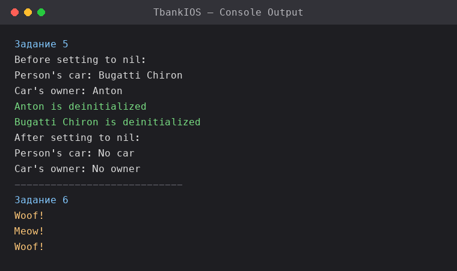

# 📱 IOS-Developer (TbankIOS)

**🇬🇧 [English](#english) · 🇷🇺 [Русский](#русский)**

> 🟡 **Учебный проект курса «iOS-разработчик» от Т-Банка (T-Bank).**
> 🟡 **Educational project from the "iOS Developer" course by T-Bank.**

<p align="center">
  
</p>

<sub>Real console output of the assignments (ARC deinitialization and polymorphism).</sub>

---

## English

An educational iOS project in **Swift** / **UIKit**, created as part of the **T-Bank "iOS Developer" course**. It collects practical assignments on core Swift topics — primarily memory management (ARC) and object-oriented programming. The results are printed to the Xcode console.

### 🗂️ Structure
| File | Topic |
|------|-------|
| `ViewController.swift` | Entry point, runs the examples |
| `FiveLesson/Taskfive.swift` | Task 5: `Person` & `Car` classes, ARC and reference cycles |
| `FiveLesson/Tasksix.swift` | Task 6: inheritance and polymorphism (`Animal` / `Dog` / `Cat`) |
| `FiveLesson/Homework.swift` | Runs and demonstrates both tasks |
| `TbankIOSTests/` | Unit tests |
| `TbankIOSUITests/` | UI tests |

### 🚀 Run
1. Open `TbankIOS.xcodeproj` in Xcode
2. Run on a simulator (⌘R)
3. The task results appear in the Xcode console (see the screenshot above)

### 🔑 Key topics & highlights

**1. ARC and breaking reference cycles (Task 5).** The core theme — **memory management in Swift**. Two classes reference each other: `Person` owns a `Car`, and `Car` references its owner. If both references are strong, the objects never get freed (a memory leak). The fix is marking the back-reference `weak`:
```swift
class Person {
    let name: String
    var car: Car?          // strong reference
    deinit { print("\(name) is deinitialized") }
}

class Car {
    let model: String
    weak var owner: Person?   // weak reference — breaks the cycle
    deinit { print("\(model) is deinitialized") }
}
```
The `deinit` method prints a message when an object is freed — so it's clearly visible that, thanks to `weak`, the memory is actually released when references are set to `nil` (see the green lines in the console screenshot).

**2. Demonstrating ARC in practice.** In `Homework.swift` the objects are created, linked, then nilled. Printing the values before and after `nil` shows the exact moment memory is freed — turning abstract ARC theory into an observable console result.

**3. Inheritance and polymorphism (Task 6).** The base class `Animal` and subclasses `Dog` / `Cat` override `speak()`. Objects of different types are placed in one `[Animal]` array, and `speak()` is called in a loop — Swift picks the right implementation for each object (dynamic dispatch).
```swift
let animals: [Animal] = [Dog(), Cat(), Dog()]
for animal in animals {
    animal.speak()   // Woof! / Meow! / Woof!
}
```
A classic example of **polymorphism**: the same call, different behaviour depending on the real object type.

**4. Optionals and safe nil handling.** The code uses optionals (`Person?`, `Car?`) and the `??` operator for defaults (`?? "No car"`) — the idiomatic Swift way to safely work with data that may be absent.

### 🛠️ Tech
**Swift** · **UIKit** · **ARC** (`weak` / `deinit`) · **XCTest** (unit & UI tests)

---

## Русский

Учебный iOS-проект на **Swift** / **UIKit**, сделанный в рамках **курса «iOS-разработчик» от Т-Банка (T-Bank)**. Здесь собраны практические задания по ключевым темам Swift — в первую очередь управление памятью (ARC) и объектно-ориентированное программирование. Результаты выводятся в консоль Xcode.

### 🗂️ Структура
| Файл | Тема |
|------|------|
| `ViewController.swift` | Точка входа, запуск примеров |
| `FiveLesson/Taskfive.swift` | Задание 5: классы `Person` и `Car`, ARC и циклические ссылки |
| `FiveLesson/Tasksix.swift` | Задание 6: наследование и полиморфизм (`Animal` / `Dog` / `Cat`) |
| `FiveLesson/Homework.swift` | Запуск и демонстрация обоих заданий |
| `TbankIOSTests/` | Unit-тесты |
| `TbankIOSUITests/` | UI-тесты |

### 🚀 Запуск
1. Открыть `TbankIOS.xcodeproj` в Xcode
2. Запустить на симуляторе (⌘R)
3. Результат заданий выводится в консоль Xcode (см. скриншот выше)

### 🔑 Ключевые темы и решения

**1. ARC и устранение циклических ссылок (Задание 5).** Главная тема — **управление памятью в Swift**. Два класса ссылаются друг на друга: `Person` владеет `Car`, а `Car` ссылается на владельца. Если обе ссылки сильные, объекты никогда не освободятся (утечка памяти). Решение — пометить обратную ссылку как `weak`:
```swift
class Person {
    let name: String
    var car: Car?          // сильная ссылка
    deinit { print("\(name) is deinitialized") }
}

class Car {
    let model: String
    weak var owner: Person?   // слабая ссылка — разрывает цикл
    deinit { print("\(model) is deinitialized") }
}
```
Метод `deinit` печатает сообщение при освобождении объекта — так наглядно видно, что благодаря `weak` память действительно очищается при присвоении `nil` (зелёные строки на скриншоте консоли).

**2. Демонстрация ARC на практике.** В `Homework.swift` объекты создаются, связываются, затем обнуляются. Печать значений до и после `nil` показывает момент освобождения памяти — абстрактная теория ARC превращается в наблюдаемый результат в консоли.

**3. Наследование и полиморфизм (Задание 6).** Базовый класс `Animal` и подклассы `Dog` / `Cat` переопределяют `speak()`. Объекты разных типов кладутся в один массив `[Animal]`, а в цикле вызывается `speak()` — Swift сам выбирает нужную реализацию для каждого объекта (динамическая диспетчеризация).
```swift
let animals: [Animal] = [Dog(), Cat(), Dog()]
for animal in animals {
    animal.speak()   // Woof! / Meow! / Woof!
}
```
Классический пример **полиморфизма**: одинаковый вызов — разное поведение в зависимости от реального типа.

**4. Опционалы и безопасная работа с nil.** В коде используются опционалы (`Person?`, `Car?`) и оператор `??` для значений по умолчанию (`?? "No car"`) — идиоматичный для Swift способ безопасно обращаться к данным, которых может не быть.

### 🛠️ Технологии
**Swift** · **UIKit** · **ARC** (`weak` / `deinit`) · **XCTest** (unit- и UI-тесты)

---
*Учебный проект курса iOS-разработки от Т-Банка: практика ARC, управления памятью и ООП в Swift. / T-Bank iOS course project: practising ARC, memory management and OOP in Swift.*
